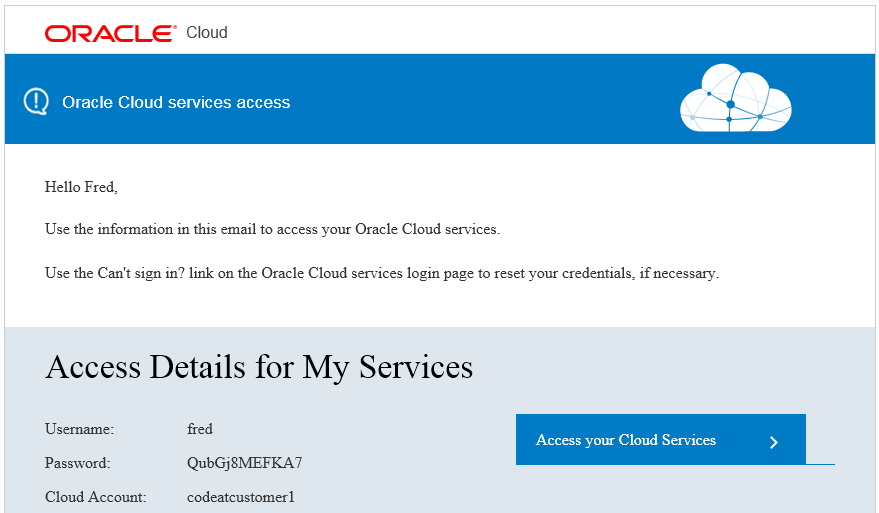
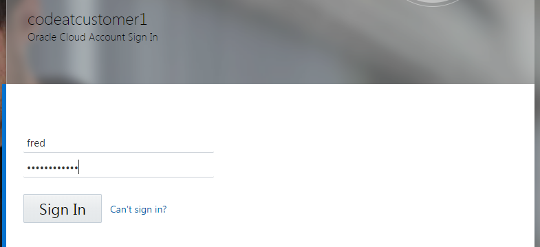
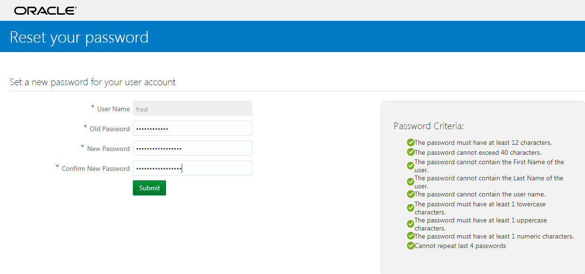
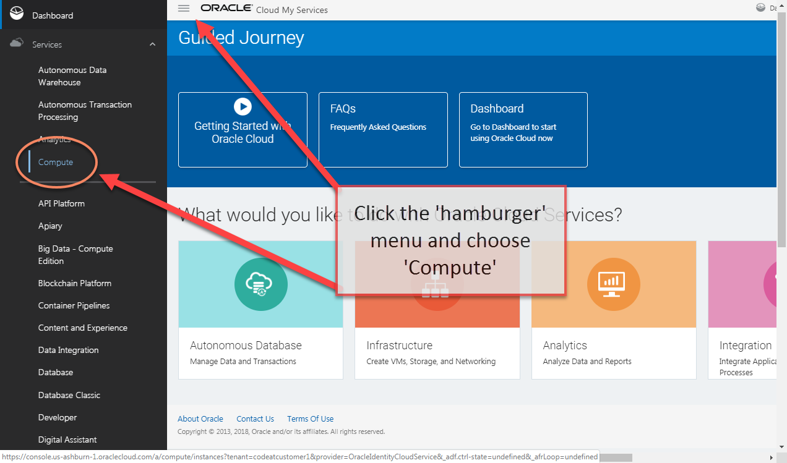
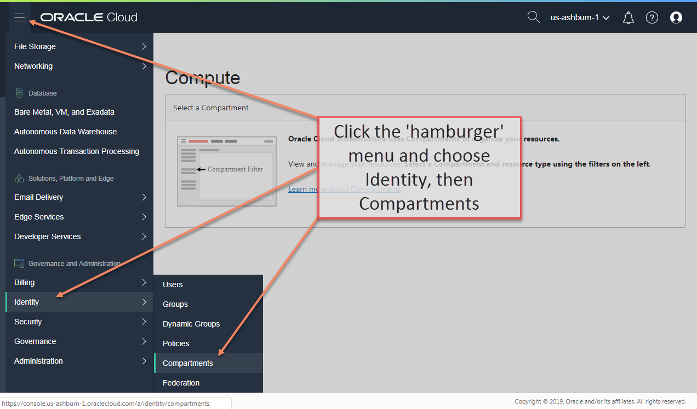
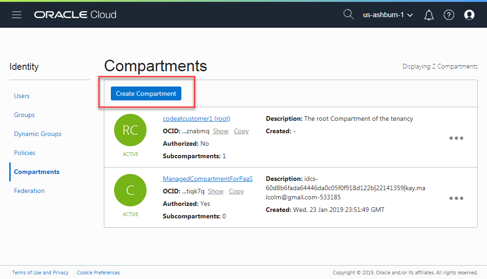
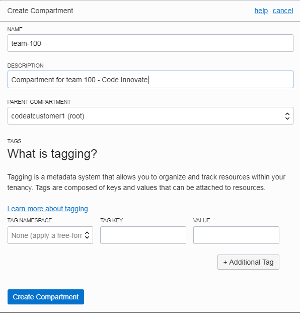
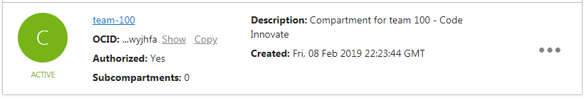
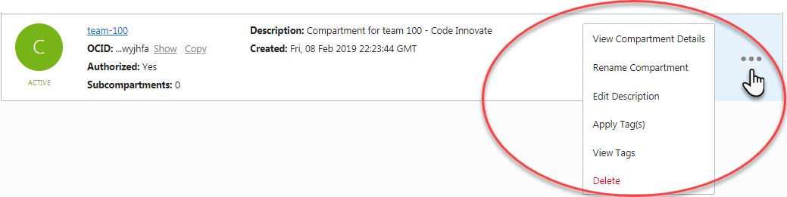

# OCI Overview Hands On Lab
Contents

[Section 1. Overview](#overview)

[Section 2. Oracle Cloud Account](#oracle-cloud-account)

[Section 3. Create a Compartment](#create-a-compartment)

## 

# Overview

This lab will introduce you to the Oracle Cloud Infrastructure service.
We will be creating a virtual cloud network, compute instances, and
block storage. Then we will install and configure Docker containers on
the compute instance. This lab is designed to be a simple introduction
to many of the services you will use in the design of a customer
solution and to familiarize you with those services.

## Objectives

1.  Obtain and access an Oracle Cloud Account

2.  Create a Compartment and a VCN

3.  Create a compute instance

4.  Create block storage

5.  Access cloud instance

6.  Install Docker and GIT

7.  Install web services

## Requirements

  - Terminal application (Windows or Linux)

  - SSH key generation ability
    
      - [Putty/PuttyGen](https://www.chiark.greenend.org.uk/~sgtatham/putty/latest.html)
    
      - ssh-keygen (Linux or GIT)

## Lab Purpose and Requirements

The purpose of this workshop is to familiarize attendees with the
feature functionality of Oracle Cloud Infrastructure. It is assumed
that attendees have a solid understanding of basic related concepts.

To optimize your experience there are some general guidelines that will
help you get the most from these lab exercises.

  - **Read through an entire exercise before executing any of the
    steps.** Merely following the screen shots or script files without
    understanding the flow will diminish your learning experience.

  - **Read all the script files before executing them.** Most of them
    are run to echo the files before actually executing the code.
    Careful reading of the file before executing will enable you to
    better understand what the script does.

  - **Ask before you do.** If you have any questions, please ask the
    instructor before you march down a path that may lead to
    unsatisfactory results.

  - **Follow the steps as shown in the workshop manual**. Don’t
    freestyle during the labs. This is a live environment. If you want
    to do something that is not in the labs, ask the lab instructor
    first. In particular, do not create, delete, or alter any database
    objects without asking first.

  - **There is no prize for finishing first; there is no penalty for
    finishing last.** The goal is to gain a firm understanding of Oracle
    Cloud Infrastructure.

  - **Ask questions freely.** The only dumb questions are those that are
    not asked.

# Oracle Cloud Account

1.  Login to the Oracle Cloud. Your username and tenancy have been
    created in advance. Your login information will be sent via email.
    Look for an email from Oracle Cloud.

##### Figure 1: Sample email

2.  Click the link in the email to access your
    services directly. Use the ***userid*** and ***temporary password***
    from the email to login. You will be asked to change your password.
    Be prepared with a strong password that meets the security criteria.

Your username will be your Oracle email address.

> 

##### Figure 2: Cloud Account login screen

> 

##### Figure 3: Password reset screen

> ***Password Criteria:***

  - *Password must have at least 12 characters*
  - *Password cannot exceed 40 characters*
  - *Password cannot contain the First or Last Name of the user*
  - *Password cannot contain the user name*
  - *Password must have at least 1 lower case character*
  - *Password must have at least 1 upper case character*
  - *Password must have at least 1 numeric character*
  - *Cannot repeat the last 4 passwords*

**Note:** *If you haven’t received an
introduction email you can login directly. Open a browser and
navigate to:* 
<https://cloud.oracle.com/en_US/sign-in>. *Use the ‘**Can’t Sign
In**’ link to reset your password, a password reset link will be sent to
your email.*

##### Figure 4: Reset password

3.  After you’ve successfully logged in, you should arrive at the Guided
    Journey screen. Choose the hamburger icon at the top left of the
    screen click **Services**, and choose **Compute.**

##### Figure 5: Guided Journey Screen

# Create a Compartment

Compartments are used to isolate resources within your OCI tenant.
Creating resources in the root compartment is not a best practice.
During the lab exercises, we suggest that you create a compartment for
your team. You can create all required resources and apply user based
access policies within a compartment.

1.  Click the **hamburger icon** in the upper left corner to open the
    navigation menu. Under the **Identity** section of the menu,
    click **Compartments**

##### Figure 6: OCI Console Compartments menu

2. Click **Create Compartment**

**Note:** *If you don’t have the proper permissions, see your tenancy administrator*

##### Figure 7:  Create compartment button

3.  Choose a descriptive **name** and enter it in the name field. Enter
    a **Description** and click **Create Compartment**.

##### Figure 8: Create compartment dialog

4.  The compartment name will show up in the list.

##### Figure 9: Compartment List

**Note:** If you want to view the compartment details, change the
compartment name, or delete the compartment, click the ellipses and
choose an option.

##### Figure 10: Compartment options

