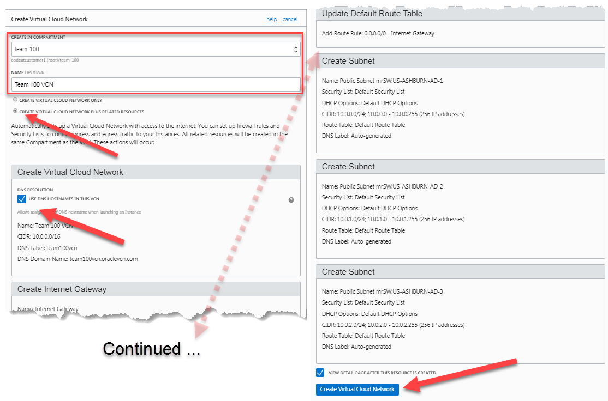
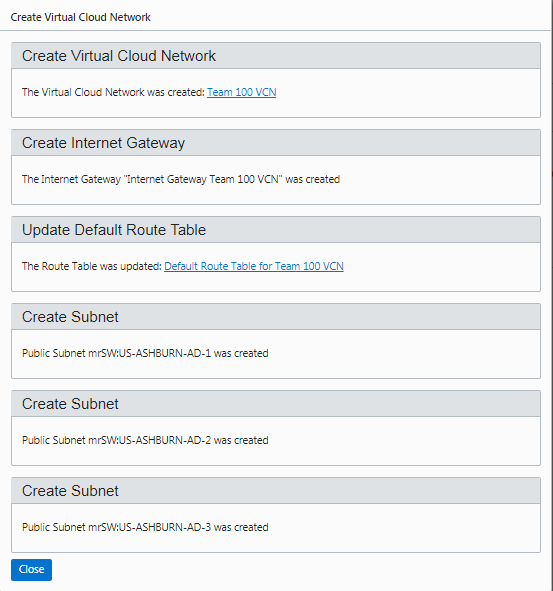
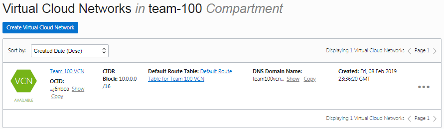
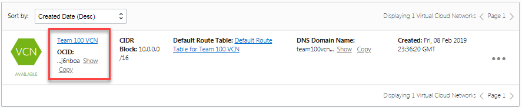
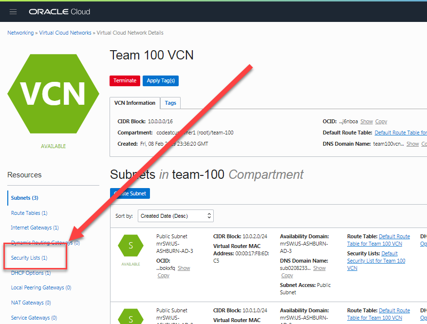
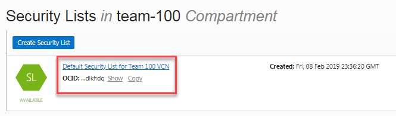
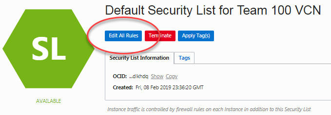
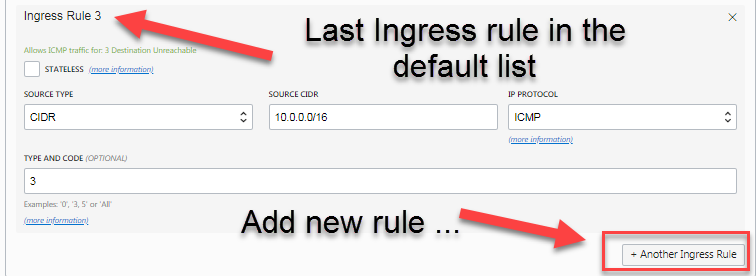
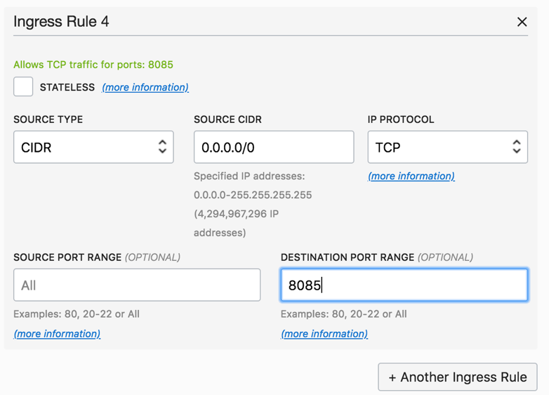
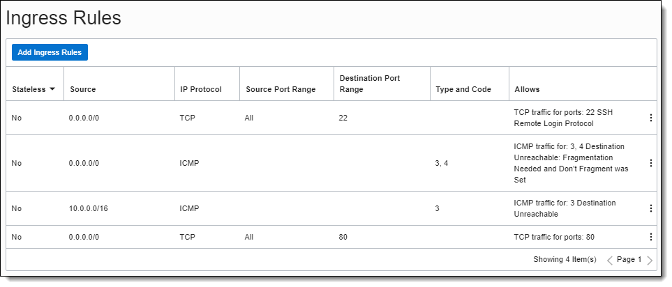

# OCI Overview Hands On Lab
Contents

[Section 4. Create a Virtual Compute Network](#create-a-virtual-compute-network)

[Section 5. Add a Security List entry](#add-a-security-list-entry)

## 

# Create a Virtual Compute Network

A VCN is the foundation of an OCI cloud environment. It provides your
customer with complete control over network communications in and out of their tenancy. The
network is the key to functionality and security within your cloud
solution. This includes assigning a private IP address space,
creating subnets, creating route tables, and configuring stateful
firewalls. A single tenancy can have multiple VCNs, thereby providing
grouping and isolation of related resources. Your customer might use
multiple VCNs to separate the resources in different departments within their
company.

VCNs are located within specific regions and are normally defined within
Availability Domains (AD). ADs are isolated for high availability.

1.  Click the **hamburger icon** in the upper left corner and navigate
    to Networking \> Virtual Cloud Networks.

 
##### Figure 11: VCN Menu Selection

2.  Click ‘**Create Virtual Cloud Network**’

##### Figure 12: Create Virtual Cloud Network

3.  Verify your compartment name in the 'Create in Compartment' dialog.
4.  Name your VCN and choose “**Create virtual cloud network plus related resources’**
    
<!-- end list -->

 Checking the ‘**Create virtual cloud network plus related resources**’ option automatically creates everything you need for a standard virtual cloud network based on a standard non-routable CIDR network numbering scheme. This includes …

<!-- end list -->

  - 3 subnets
  - 1 route table
  - 1 internet gateway
  - 1 security list
  - 1 DHCP option

##### Figure 13: Create Virtual Cloud Network dialog

5.  Ensure that ‘Use DNS hostnames in this VCN’ is checked.

6.  Confirm the details of the automatically created VCN. There should be a VCN, an Internet Gateway, a Default Route Table, and three subnets.

7.  Click **Create Virtual Cloud Network**

##### Figure 14: Confirm Create Virtual Cloud Network dialog

9.  Click Close on the dialog to return to VCN creation. The VCN you created should appear and immediately be in the Available state.

##### Figure 15: VCN Available Description

# Add a Security List entry

A security list is a virtual firewall for an instance, with rules that specify the types of traffic allowed in and out, called ingress and egress respectively. Security lists are enforced at the instance level. However, security lists are configured at the subnet level, which means that all instances in a given subnet are subject to the same set of rules. The security lists apply to a given instance whether it's communicating with another instance in the VCN or a host outside the VCN.

For this particular lab we will be adding security rules to allow access to our Docker container.

1.  Click on the VCN you created (ex: *Team 100 VCN*) and then choose **Security Lists** from the side panel selections

##### Figure 16: VCN Details

##### Figure 17: Security List option

2.  Click on **Default Security List** for \<*your VCN name*\>

##### Figure 18

**Note:** *For the upcoming Docker deployments we will add five Ingress Rules that allow Internet access to ports 9080, 8002, 18002, 5600, and 8085. In a production environment, only the UI port (8085) would typically be exposed to the internet. These ports are being expose for testing of other Applications and certain Oracle centric functionality for lab purposes only.*

3.  Click **Edit All Rules**

**Note:** *Do not edit or remove existing rules, add new ones to the list.*

##### Figure 19: Edit All Rules button

4.  Select **+ Another Ingress Rule** button at the bottom.

##### Figure 20: + Another Ingress Rule button

5.  Enter the following details as Ingress Rules 4, 5, 6, 7, and 8.  Leave all other values at their default.

**Ingress Rule 4**

  - Source CIDR: 0.0.0.0/0
  - Destination Port Range: 8085

##### Figure 21: Ingress Rule 4 example

**Ingress Rule 5**

  - Source CIDR: 0.0.0.0/0
  - Destination Port Range: 9080

**Ingress Rule 6**

  - Source CIDR: 0.0.0.0/0
  - Destination Port Range: 8002

**Ingress Rule 7**

  - Source CIDR: 0.0.0.0/0
  - Destination Port Range: 18002

**Ingress Rule 8**

  - Source CIDR: 0.0.0.0/0
  - Destination Port Range: 5600

##### Figure 22: Ingress Rule 8 example

6.  Click the **Save Security List Rules** button at the bottom of the
    page.

##### Figure 23: Save security list rules button

##### Figure 24: Completed ingress rules example

