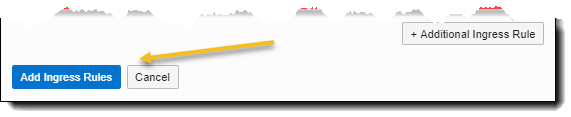

## Class of SE - HOL Part 2 - Creating a VCN

Contents

[Section 4. Create a Virtual Compute Network](#create-a-virtual-compute-network)

[Section 5. Add a Security List entry](#add-a-security-list-entry)

## 

#
# Create a Virtual Compute Network

A VCN is the foundation of an OCI cloud environment. It provides your customer with complete control over network communications in and out of their tenancy. The network is the key to functionality and security within your cloud solution. This includes assigning a private IP address space, creating subnets, creating route tables, configuring stateful firewalls, and creating security rules. A single tenancy can have multiple VCNs, thereby providing grouping and isolation of related resources. Your customer might use multiple VCNs to separate the resources in different departments within their company.

VCNs are located within specific regions and are normally defined within Availability Domains (AD). ADs are isolated for high availability.

1.  Click the **hamburger icon** in the upper left corner and navigate to Networking \> Virtual Cloud Networks.

 
*
 Figure 11: VCN Menu Selection 
*

2.  Verify you have selected the correct compartment name.
3.  Click ‘**Create Virtual Cloud Network**’

*
 Figure 12: Create Virtual Cloud Network 
*

4.  Name your VCN, verify the correct compartment has been selected, and click the radio button for  “**Create virtual cloud network plus related resources’**
    
<!-- end list -->

 Choosing the ‘**Create virtual cloud network plus related resources**’ option automatically creates everything you need for a standard virtual cloud network based on a standard non-routable CIDR network numbering scheme. This includes …

<!-- end list -->

  - 3 subnets
  - 1 route table
  - 1 internet gateway
  - 1 security list
  - 1 DHCP option

*
 Figure 13: Create Virtual Cloud Network dialog 
*

5.  Ensure that ‘Use DNS hostnames in this VCN’ is checked.

6.  Confirm the details of the automatically created VCN. There should be a VCN, an Internet Gateway, a Default Route Table, and three subnets.

7.  Click **Create Virtual Cloud Network**

*
 Figure 14: Confirm Create Virtual Cloud Network dialog 
*

9.  Click Close on the dialog to return to VCN creation. The VCN you created should appear and immediately be in the Available state.

*
 Figure 15: VCN Available Description 
*

# Add Security List entries

A security list is a virtual firewall for an instance, with rules that specify the types of traffic allowed in and out, called ingress and egress respectively. Security lists are enforced at the instance level. However, security lists are configured at the subnet level, which means that all instances in a given subnet are subject to the same set of rules. The security lists apply to a given instance whether it's communicating with another instance in the VCN or a host outside the VCN.

For this particular lab we will be adding security rules to allow access to the GIT version control software we'll be installing later.

1.  Click on the VCN you created (ex: *Team 100 VCN*) and then choose **Security Lists** from the side panel selections

*
 Figure 16: VCN Details 
*

*
 Figure 17: Security List option 
*

2.  Click on **Default Security List** for \<*your VCN name*\>

*
 Figure 18: Default Security list
*

**Note:** *For the GIT software installation, we will add three ingress rules to allow connections to the GIT instance.  Git can be access using SSH through port 22.  That rule is configured by default.  We will add port 9418, http access through port 80, and the default secure http (https) port of 443.*

3.  Click **Add Ingress Rules**

**Note:** *Destination port 22 for TCP SSH traffic has already been added as a default option.*

*
 Figure 19: Add Ingress Rules button 
*

4.  Enter the following items in dialog:

    - Source CIDR: 10.0.0.0/16
    - Destination port Range: 9418

After you've filled in the proper information, click **+ Additional Ingress Rules** at the bottom of the dialog to add another rule.

*
 Figure 20: Add Ingress Rules dialog 
*

5.  You will add two additional ingress rules.  Enter the following details as *Ingress Rules 2 and 3*.  Leave all other values at their default.

**Ingress Rule 2**

  - Source CIDR: 0.0.0.0/0
  - Destination Port Range: 80

**Ingress Rule 3**

  - Source CIDR: 0.0.0.0/0
  - Destination Port Range: 443

*
 Figure 21: All ingress rules added 
*

6.  Click the **Add Ingress Rules** button at the bottom of the
    page.

*
 Figure 22: Add Ingress Rules button 
*

*
 Figure 23: Completed ingress rules example 
*

This lab segment is complete.  If there is time left before the next lecture, browse the OCI cloud interface and familiarize yourself with the layout and basic services.  Wait for the instructor to let you know when to begin section 3.