# OCI Overview Hands On Lab
Contents

[Section 9. Install and configure Docker and GIT](#install-and-configure-docker-and-git)

[Section 10. Edit /etc/sysconfig/selinux](#edit-etcsysconfigselinux)

[Section 11. Docker basics](#docker-basics)

[Section 12. Block Volume Service](#block-volume-service)

[Section 13. CONCLUSION](#conclusion)

## 


# Install GIT and Configure Block Storage

# ````Note to self:  Change this section to only install GIT and adding block storage.````

In the next sections you will install the Docker engine, enable it to start on re-boot,
grant Docker privileges to the opc user and finally, install GIT to simulate a simple development environment.

1.  **Change to root and install Docker. Type** the following commands in the terminal window. Answer **‘Y’** when system prompts you if the installation of Docker is okay.

    `[root@docker01 opc]# sudo –s`

    `[root@docker01 opc]# yum install docker-engine`

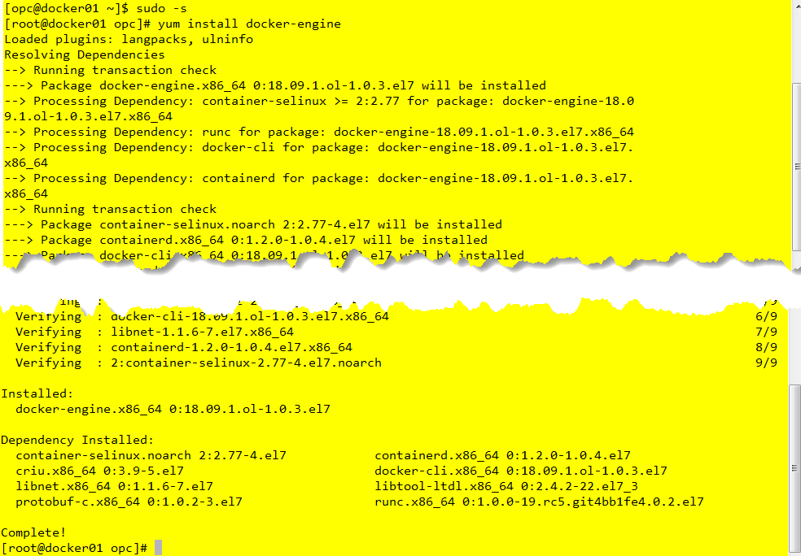

##### Figure 49: Docker install screen example

28. Add opc to the docker group and enable and start Docker.

    `[root@docker01 opc]# usermod –aG docker opc`

    `[root@docker01 opc]# systemctl enable docker`

    `[root@docker01 opc]# systemctl start docker`

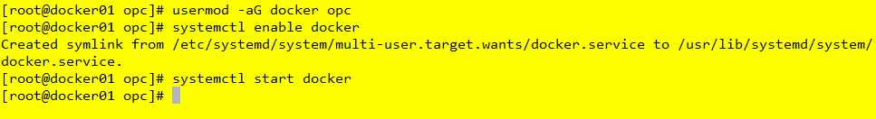

##### Figure 50: Enable user, systemctl command, and docker startup

29. Install GIT

`[root@docker01 opc]# yum install git`

30. Answer ‘y’ when prompted ‘Is this ok’

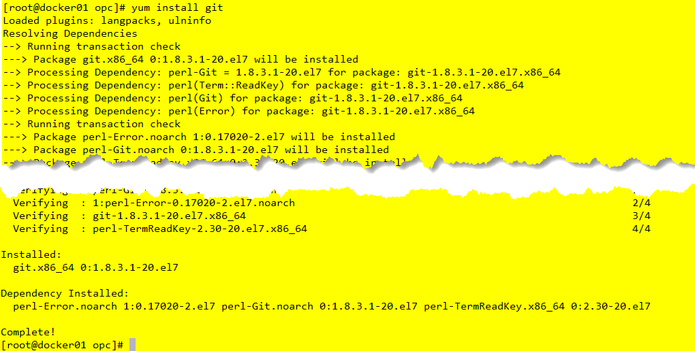

##### Figure 51: GIT installation command dialog

31. **Type** the following commands to verify Docker and GIT have been installed and are working properly.

    `[root@docker01 opc]# su – opc`

    `[root@docker01 opc]# docker version`

    `[root@docker01 opc]# docker images`

    `[root@docker01 opc]# git –-version`

**Note:** *If you get failed permissions on the docker version command, try completely logging out and back into your SSH terminal session.*

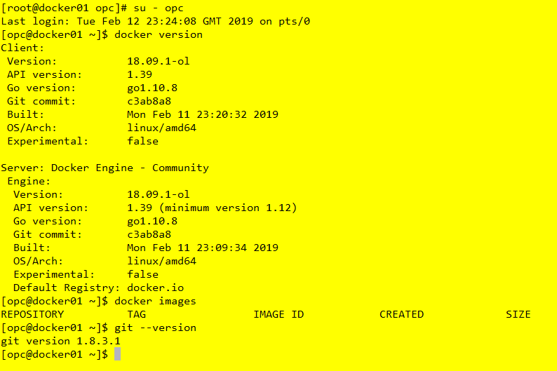

##### Figure 52: Docker and GIT version verification


# Edit /etc/sysconfig/selinux

1.  Set the server to permissive mode and make the change permanent to survive restarts.

**Note:** *Use vi or any available editor and edit the /etc/sysconfig/selinux file. You must be root to edit this file.*

32. Change the line SELINUX=enforcing to SELINUX=permissive

    `[opc@docker01 opc]# sudo su`

    `[root@docker01 opc]# vi /etc/sysconfig/selinux`

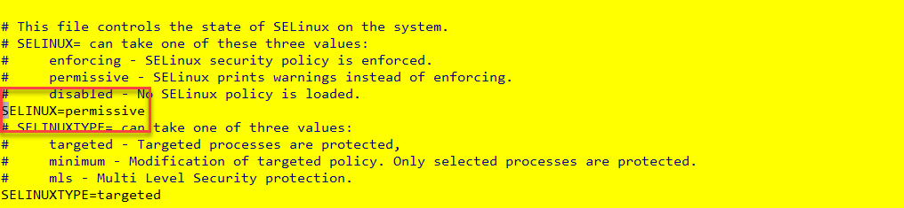

##### Figure 53: Permissive mode set in configuration file

33. Save the file and exit the editor. Type the following to verify
    the server is in permissive mode.

    `[root@docker01 opc]# setenforce 0`

    `[root@docker01 opc]# sestatus`

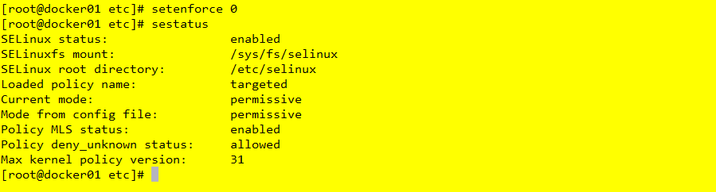

##### Figure 54: SE Linux status command

34. Type the following commands to exit the root account and return to the opc user.

    `[root@docker01 opc]# exit`

    `[opc@docker01 opc\]\# whoami`

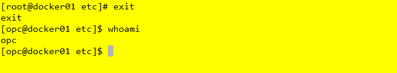

##### Figure 55: Exit to 'opc' user

# Docker basics

This section of the lab will introduce the learner to Docker by showing
them how to create a container architecture, REST, and a simple micro
service.

  - [<span class="underline">Docker Documentation</span>](https://docs.docker.com/)
  - [<span class="underline">Container Documentation</span>](https://docs.docker.com/glossary/?term=container)
  - [Docker Hub](https://hub.docker.com/)

**Objectives**

  - Deploy and test a Docker container running an application
  - Use the Docker Hub registry
  - Learn Docker commands
  - Learn the basics of container networking and file system mapping.

**Requirements:**

  - Docker Hub Account (*provided*)
  - Docker and GIT installed in a Linux cloud instance

<!-- end list -->

1.  Before creating a container, verify the Docker installation and that it’s running correctly.

2.  If not still logged in, SSH as the ‘opc’ user into the Linux OCI image (Docker01) created earlier.

3.  Verify that Docker is running. **Type** the following to verify the Docker version:

`[opc@docker01 opc]# docker version`

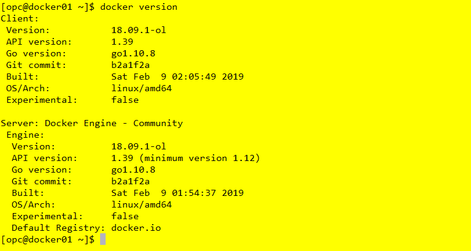

##### Figure 56: Docker version command

4.  The docker ps command shows information about containers. We haven’t created anything yet but let’s see if there are any containers currently running. Type the following command.

    `[opc@docker01 opc]# docker ps`

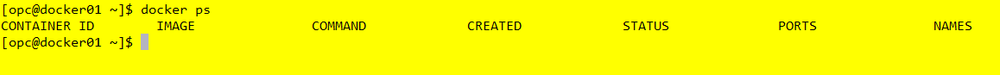

##### Figure 57: Docker ps

## Download and create a container from an image.

In the next few steps we will download an image from the Docker Hub and create a container from that image. The image contains a JSON formatted data file with test data that can be accessed via its exposed REST service. Docker will search for the designated image locally before going to Docker HUB.

| \-d, --detach                       | Runs the container in the background                                                                           |
| ----------------------------------- | -------------------------------------------------------------------------------------------------------------- |
| \-it, -i interactive, -t pseudo TTY | Allocates a pseudo-TTY connected to the container’s stdin, creating an interactive bash shell in the container |
| \-rm                                | When this container is stopped all resources associated with it (storage, etc) will be deleted                 |
| \-name string                       | Assign a name to the container                                                                                 |
| \-p                                 | Publish a containers port to the host (8002)                                                                   |
| \-e                                 | Set environment variables. DS designates JSON datasource                                                       |

##### Figure 34: Docker run command flag descriptions

1.  **Type** the following command to download the image.

    `[opc@docker01 opc]# docker run –d –it --rm --name restclient -p=8002:8002 –e DS=’json’ wvbirder/restclient`

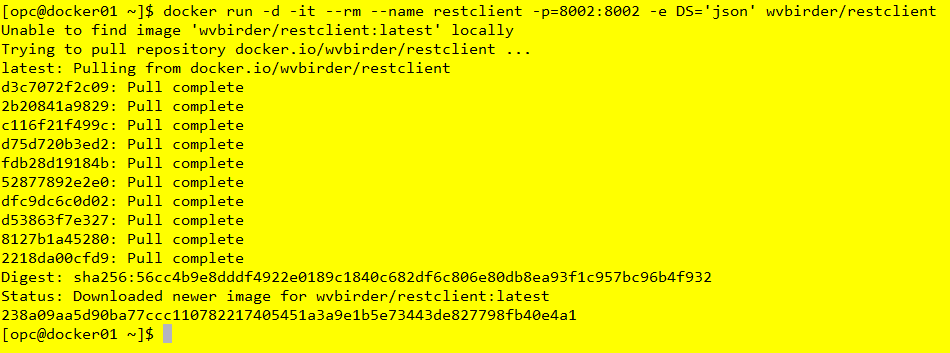

##### Figure 58: Docker run command output

## Check running containers

2.  Run the following command to check out the container that was just created.

    `[opc@docker01 opc]# docker ps`

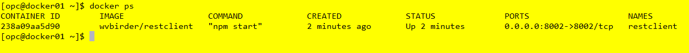

##### Figure 59: Docker ps command with running container

Verify that a unique container ID was assigned and that the container's port is mapped to 8002, which is the same as the Host's port.

## Connect to the application with a browser

3.  Use the Public IP address to test the deployment. Open the OCI console and use the top left hamburger menu to navigate to Compute > Instances. We will open the instance details menu and obtain the public IP address that was assigned.

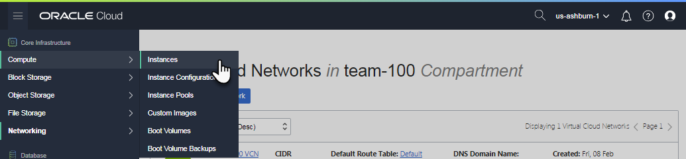

##### Figure 60

4.  Click on the **Docker** instance link or use the ellipses on the right side to open the menu and choose View Instance Details.

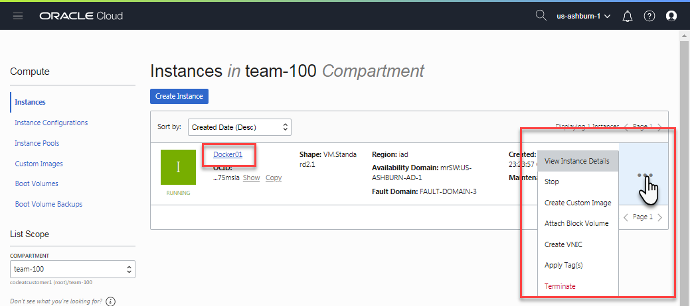

##### Figure 61

5.  You’ll find the Public IP address in the Primary VNIC field.

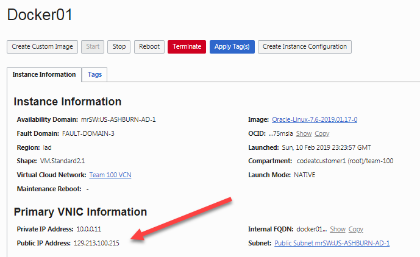

##### Figure 62: Public IP address from OCI instance screen

6.  Copy the IP address and paste into a browser on your local machine, followed by the port number of the docker container (:8002).

    `http://<your public ip address>:8002`

Example: http://129.213.100.215:8002

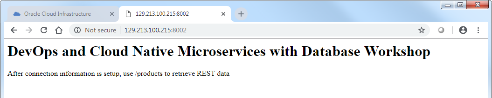

##### Figure 63: Successful connection to application

7.  Next add the folder that contains the data. Enter the following information into your browsers address bar.

    `http://<your public ip address>:8002/products`

Example: http://129.213.100.215:8002/products

8.  If your browser contains a JSON Formatter add-on then the output will look like the below screenshot.

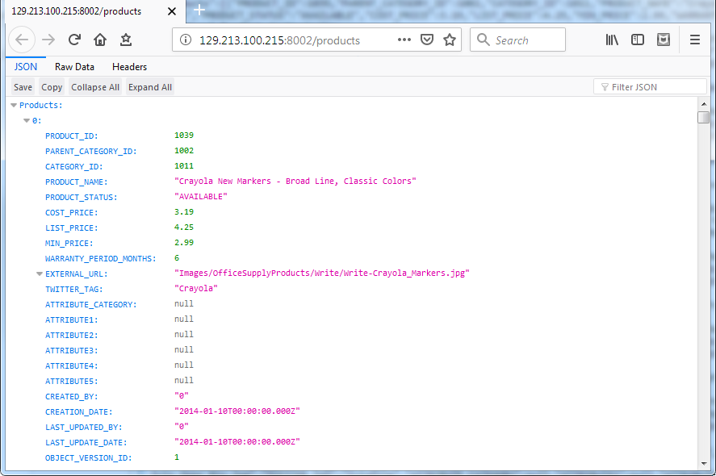

##### Figure 64: JSON formatted output

9.  If no JSON formatter is present, the output will look like the below screen shot. Either way is fine.

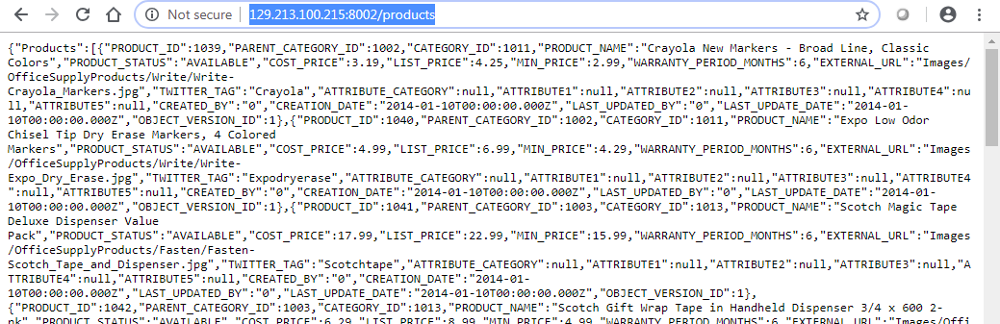

##### Figure 65: Non-JSON formatted output

10. Use the following commands to stop the container so we can start it on another port and view status after the command has run.

    `[opc@docker01 opc]# docker stop restclient`

    `[opc@docker01 opc]# docker ps -a`

**Note:** We started the restclient container with the `--rm` option, so stopping it will remove all allocated resources

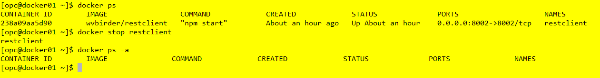

##### Figure 66: Deleted container

The `–ps` command shows that the container has been deleted.

## Start another Container with a different HOST Port

11. Type the following to start another container on port 18002

    `[opc@docker01 opc]# docker run –d –it --rm --name restclient -p=18002:8002 –e DS=’json’ wvbirder/restclient`

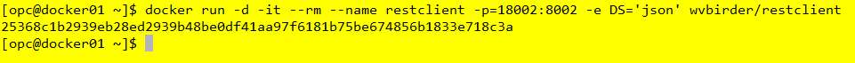

##### Figure 67: Start container with new port assignment

12. Type in the public IP address and folder in your web browser but substitute port 18002 for port 8002. Note that we mapped port 8002 to 18002 in the container startup command.

    `http://<your public IP address>129.213.100.215:18002/products`

**Example** http://129.213.100.215:18002/products

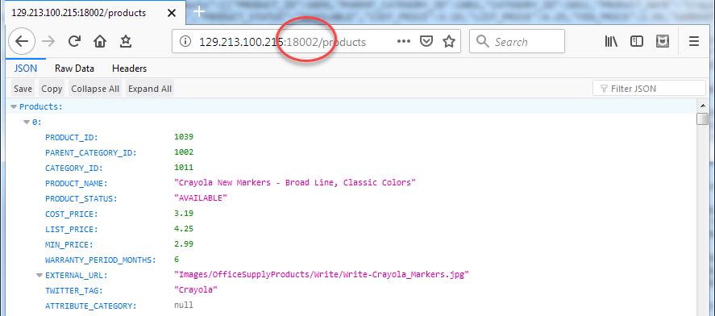

##### Figure 68: Substitute port 18002 in web url

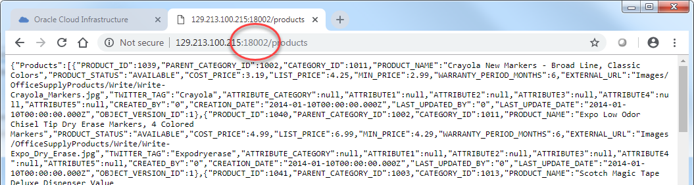

##### Figure 69: New port assignment in browser

## Inspect the Container's Network and IP Address

13. Use the following commands to inspect the networking information that Docker uses when setting up containers. The ip command shows that Docker has created a network connection with an assigned IP    address.

    `[opc@docker01 opc]# ip address`

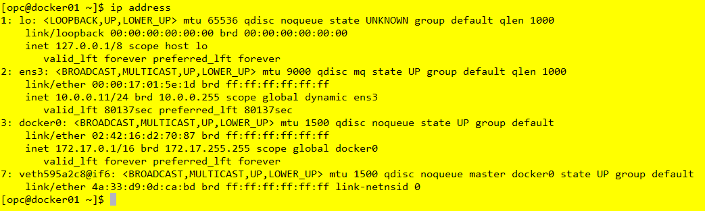

##### Figure 70: IP Address Check

14. The Docker network command shows the three default networks that Docker creates automatically. Docker always launches containers in the bridge network unless instructed otherwise.

    `[opc@docker01 opc]# docker network ls`

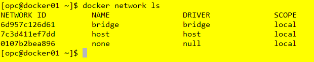

##### Figure 71: Docker network command

15. The docker network inspect bridge command shows us detailed information about the Docker bridge network, including the assigned IP address and the assigned container name.

    `[opc@docker01 opc]# docker network inspect bridge`

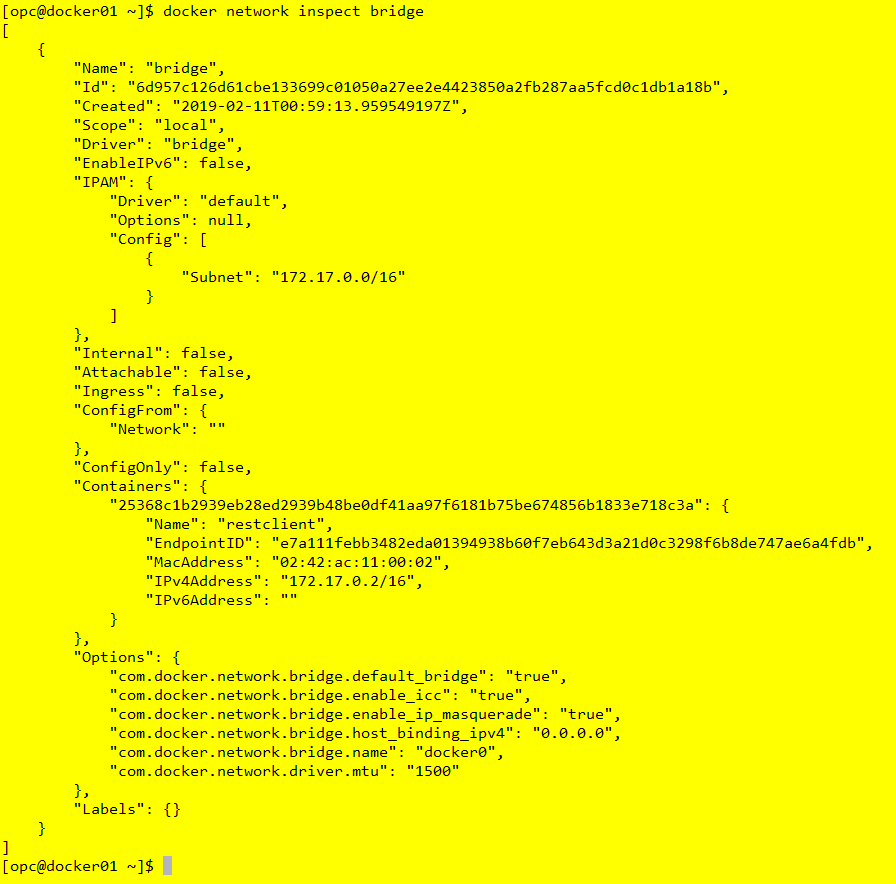

##### Figure 72: Docker network inspect bridge output

16. You can ping the Docker IP address from your host server. Issue the ping command to the Docker IP address in your terminal window.

    `[opc@docker01 opc]# ping 172.17.0.2 –c3`

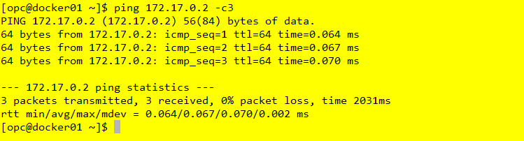

##### Figure 73: Ping command to test internal access

17. And finally, stop the restclient container and verify it has been
    removed from the list.

    `[opc@docker01 opc]# docker stop restclient`

    `[opc@docker01 opc]# docker ps -a`

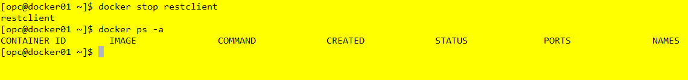

##### Figure 74: Stop restclient command

# Block Volume Service

**Overview**

OCI Block Volumes can be created, attached, moved, and deleted as needed to support storage needs. Block volumes can be moved to another image without loss of data. In this portion of the exercise we will create a block volume and attach it to our instance.

## Create a block volume to increase capacity on an instance.

1.  Use the hamburger menu in the upper left of the OCI console and choose Block Storage > Block Volumes

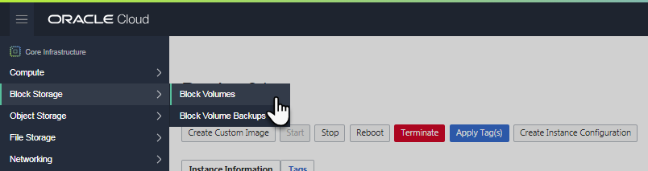

##### Figure 75: Block Volume item selection

2.  In the Block Volumes dialog, verify that your compartment is selected and click on the Create Block Volume button

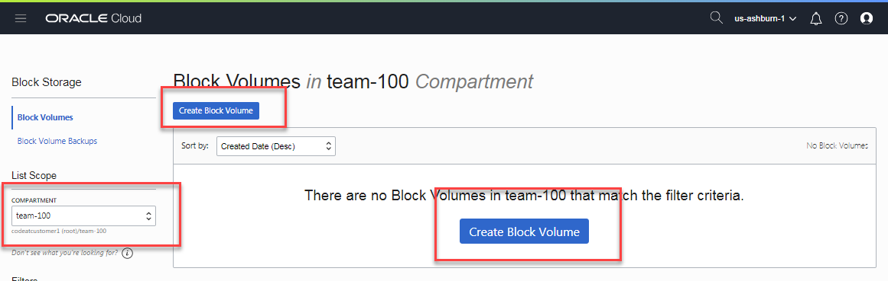

##### Figure 76: Create Block volume in assigned compartment

3.  Fill in the following details in the Create Block Volume dialog.

<!-- end list -->

- Create in compartment: \<your compartment\>
- Name: \<choose a name\> ex: volume01
- Availability Domain: \<Choose the AD specified for your team\>
- Size: 50GB *(50GB is the minimum allowed. 32TB is the max)*
- Backup Policy: Gold

**Note:** *There are four backup policies, none, bronze, silver, and gold. You can read more about what’s included in each policy here. [Volume Backup
Policies](https://docs.cloud.oracle.com/iaas/Content/Block/Tasks/schedulingvolumebackups.htm)*

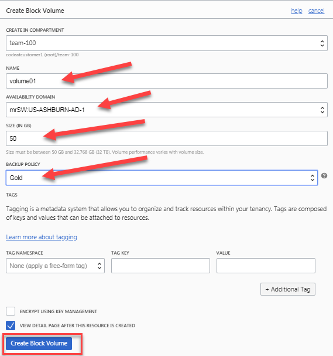

##### Figure 77: Create Block Volume dialog form

4.  Click on **Create Block Volume**, in a few moments the icon will turn green and your block volume will be provisioned.

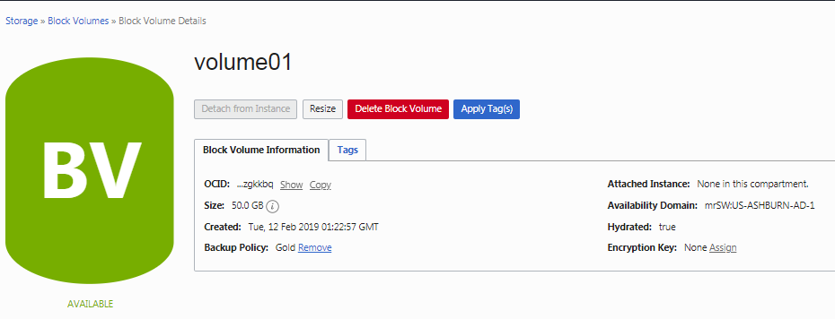

##### Figure 78: Block Volume Available

5.  Attach the block volume to an instance.

6.  Navigate to the **Compute > Instances** menu to view instance.

7.  You can use the instance menu to attach a block volume. Click on the ellipses to view the menu, then select **Attach Block Volume**.

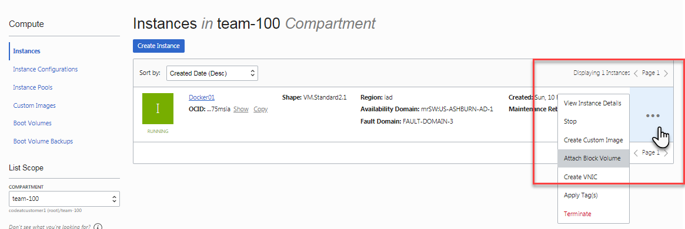

##### Figure 79: Instance action menu

8.  Or you can open the instance details menu and attach a block volume from there.

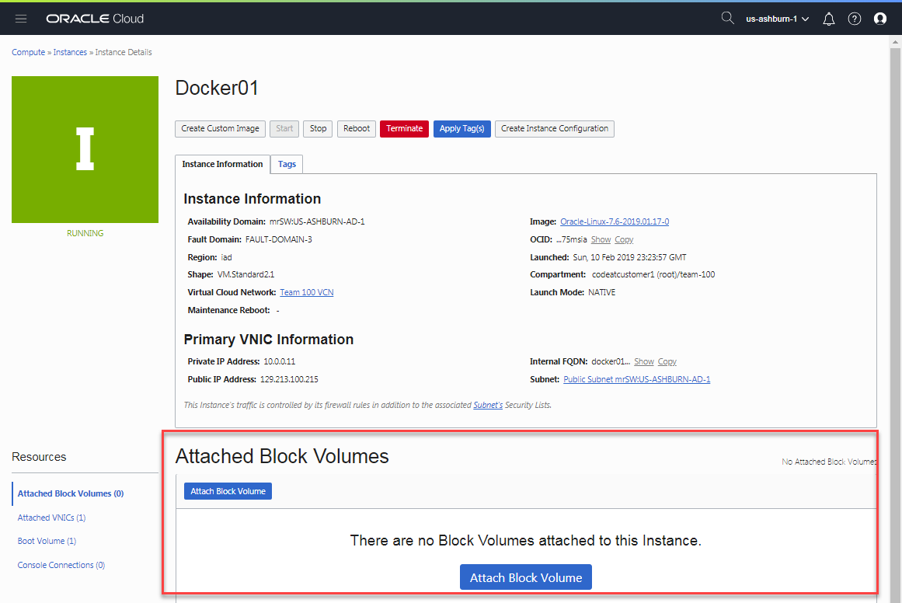

##### Figure 80: Attach Block Volume

9.  In the Attach Block Volume dialog you can select iSCSI or Paravirtualized as the attachment type. Paravirtualized will connect the volume directly without any further commands, but at a potential performance trade-off from iSCSI. iSCSI attach will require iSCSI commands to be run on the host. These commands are also provided for you in the interface.

10. Fill out the dialog, choose iSCSI, your compartment, choose the volume name you created earlier and click Attach. Leave Device Path, CHAP, and Access at their defaults.

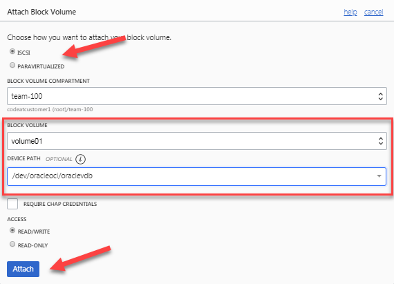

##### Figure 81: Attach block volume dialog

11. You will see a message about iSCSI attachment commands. Click **Close** to dismiss this message.

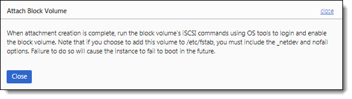

##### Figure 82: Attach block volume instuctions

12. When the volume finishes attaching, the icon will turn green with the Attached label below it. Click on the ellipsis and choose iSCSI Commands & Information

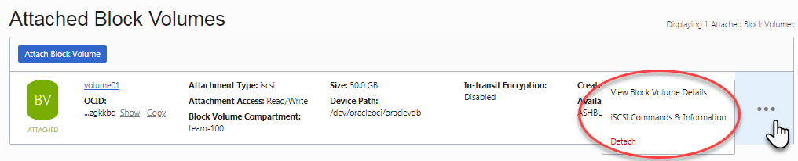

##### Figure 83: iSCSI command dialog

13. Copy the iSCSI attach commands and paste them into the terminal windows that’s running as ‘opc’. Or you can use the ‘Copy’ button to copy all of the commands at once.

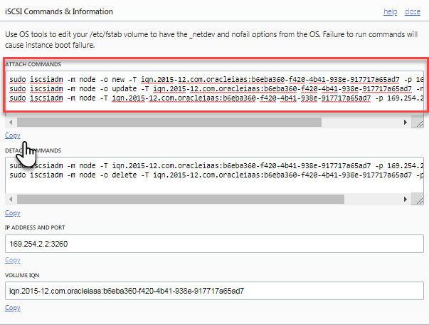

##### Figure 84: iSCSI commands and information

14. Go to the terminal window and issue the lsblk command to verify that nothing has been mounted yet.

    `opc@docker01 opc]# lsblk`

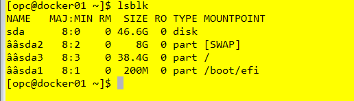

##### Figure 85: Linux lsblk command output

15. Issue the iSCSI commands you copied from the Block Volume interface. (Your commands will be different)

    `sudo iscsiadm -m node -o new -T iqn.2015-12.com.oracleiaas:b6eba360-f420-4b41-938e-917717a65ad7 -p 169.254.2.2:3260`

    `sudo iscsiadm -m node -o update -T iqn.2015-12.com.oracleiaas:b6eba360-f420-4b41-938e-917717a65ad7 -n node.startup -v automatic`

    `sudo iscsiadm -m node -T iqn.2015-12.com.oracleiaas:b6eba360-f420-4b41-938e-917717a65ad7 -p 169.254.2.2:3260 -l`

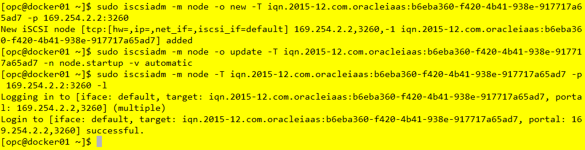

##### Figure 86: iSCSI commands to mount disk on the instance

16. Run the lsblk command to verify that the disk has been recognized by the operating system.
    
    `[opc@docker01 opc]# lsblk`

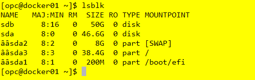

##### Figure 87: Linux lsblk command showing attached disk

17. Run the following commands to format the disk and mount it. Press Y to proceed anyway when prompted about one partition.

    `[opc@docker01 opc]# sudo mkfs –t ext4 /dev/sdb`

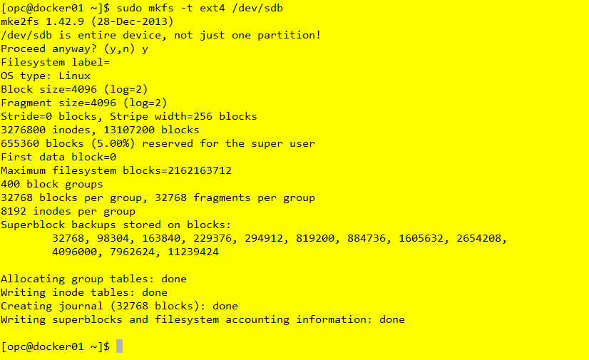

##### Figure 88: File system commands for mounted volume

`[opc@docker01 opc]# sudo mkdir /mnt/disk1`

`[opc@docker01 opc]# sudo mount /dev/sdb /mnt/disk1`

`[opc@docker01 opc]# ls –l /mnt/disk1`

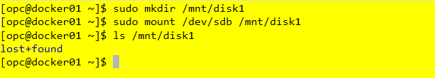

##### Figure 89: Linux mount commands for block volume

# CONCLUSION

This lab introduced you to the Oracle Cloud Infrastructure service.  Let’s review what you did.

You created a virtual cloud network, a compute instance, and block storage. You installed and configured Docker containers on the compute instance you created. This lab was designed to introduce you to many of the services you will use in the design of a customer solution and to
familiarize you with those services.

## What you completed

  - Accessed your Oracle Cloud Account

  - Created a Compartment and a VCN

  - Created a compute instance

  - Created block storage

  - Accessed cloud instance

  - Installed Docker and GIT

  - Installed web services

##

