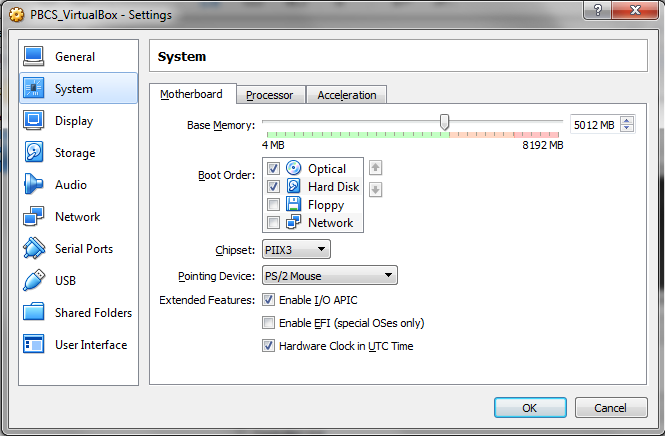

Lab Guide

Topic Name

Date (January 1, 2019)

Sample Table of Contents

# LAB GuIDE OVerview

These labs are designed to complement your training, reinforcing the key
concepts by applying and demonstrating what you learn in the
presentation sessions. This lab guide is comprised of one or more labs.
Each lab allows you to get first hands-on exposure working with “LAB
Cloud” products using a demo environment, where you will see how key
features and functionality are deployed in the software. Upon completion
of each lab, a group review of the key takeaways will follow, tying back
product content to the sales messaging and positioning.

## Labs

Description of business solution….

**Prerequisite**: Before starting these labs, you should have ….

**NOTE:** Content is driven by external factors such as user data
entries and login date. As a result, what you see displayed in your
environment may not exactly match with the lab screenshots. Screenshots
are provided solely for illustrative purposes to help guide you through
the user interface.

# Lab 1: Name of Lab

This is a lab that I will create

  - Key features and functionality

<!-- end list -->

  - Built-in best practice predefined content

  - Drivers and key performance indicators (KPIs)

<!-- end list -->

  - Ease of use with configuration wizards

  - Planning and reporting needs in one centralized repository

**Note**: Be sure you are NOT connected to Oracle VPN when running the
VM and performing the lab exercises.

## Lab 1: Name of LAB (followed by numbered action steps of the exercise, screenshots, and NOTEs). 

1.  Open…
    
    1.  Optional…

2.  Click….

Figure 1.1

3.  Enter…..

4.  Close screen…..

**Note:** The following instructions cover general steps to back up demo
content for most EPM Cloud services. Minor differences will exist with
updates to the software. Steps and screenshots provided are based on EPM
Version 16.09 User Interface and are provided solely for illustrative
purposes.

# Lab 2: Name of Lab

Description and purpose of Lab 2….

## Lab 2: Name of LAB (followed by numbered action steps of the exercise, screenshots, and NOTEs). 

1.  Open…

2.  Click….

# Appendix: Name of Appendix
