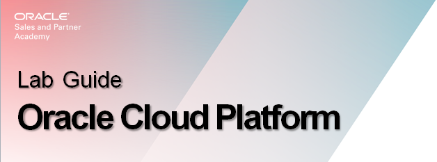
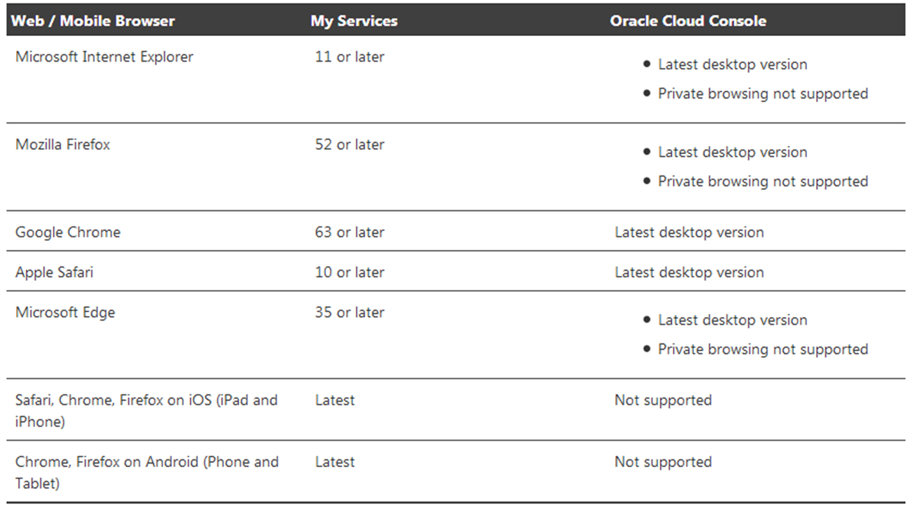
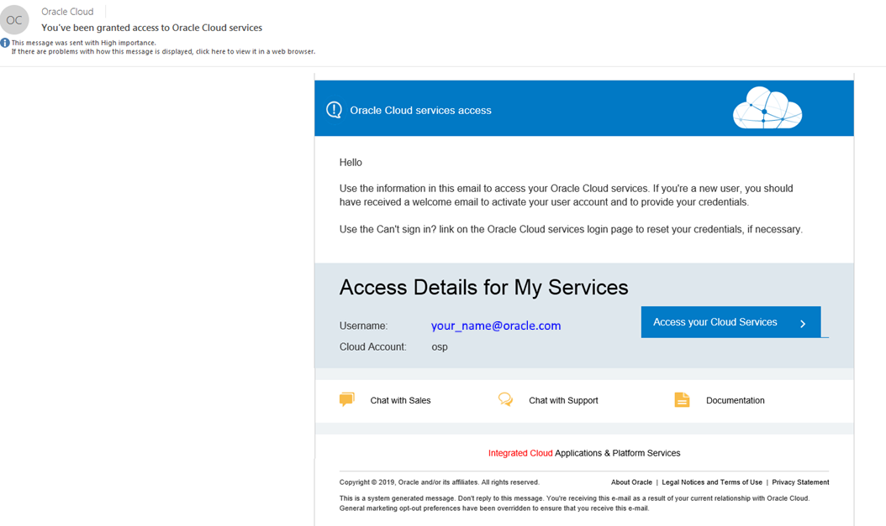
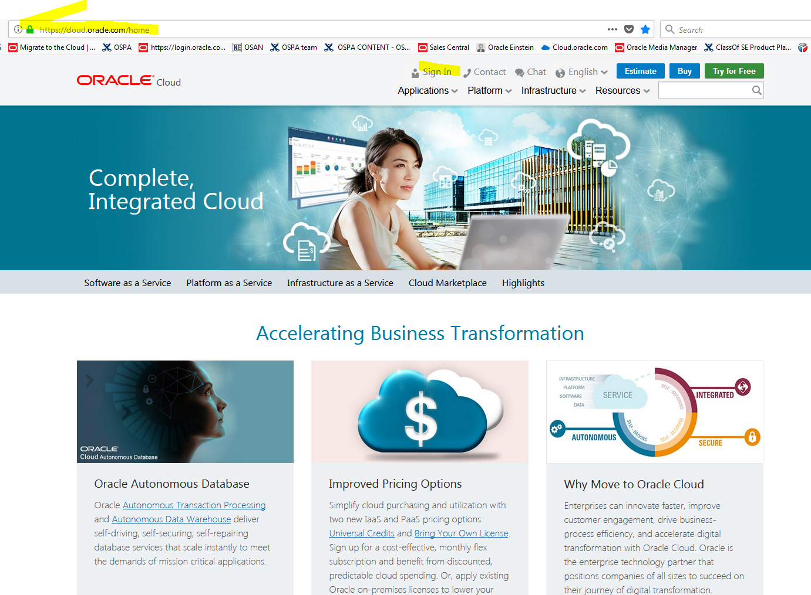

# Class of SE - HOL Lab Preparation

Were going to review the set-up requirements and how to gain access to the
Oracle Cloud.

Where to locate and get Oracle Cloud help: services, documentation, etc.

So you can successfully login and use the Oracle Cloud this week for the
upcoming sessions.

# Oracle Cloud Prerequisites

To perform labs for this session and the rest of the week:

Primary requirement: supported web browser and working internet connection

-   Chrome 63 or later is recommended for lab work this week

-   Install Chrome now should you not already have it

-   <https://www.google.com/chrome/>

*
Figure 1: Supported Browsers 

Email for Login & Link to Cloud My Services

1.  After you sign up for the free Oracle Cloud promotion or sign up for a paid
    account, or as with this lab, you’ll get a welcome email. The email provides
    you with your cloud account details and sign in credentials

2.  Scroll down to the Access Details section and note user name and password

3.  Note your the name of your Cloud Account, Access Details, and Identity
    Domain

4.  Click Access your Cloud Services to get started

5.  Bookmark it before you sign-in

*
Figure 2: My Services Details
*

**Note:**  *Also a right mouse click on Access your Cloud Services box enables you to capture the URL so you can save a copy or bookmark it. Make sure to keep a copy of that email for later reference.*

Cloud.oracle.com

*
Figure 3: Oracle Cloud Home 
*

# Summary of Learning

-   You understand and have verified you meet the prerequisites to using the
    Oracle Cloud

-   You know the initial email is important as it has the Oracle Cloud access
    link and initial sign-in credentials. And check the SPAM folder when it does
    not appear when expected

-   You can successfully login and actively participate in the HOL work in the
    rest of the training session this week
