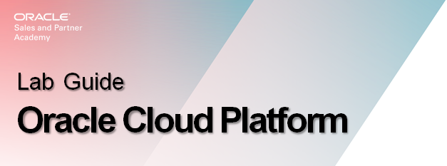
# Class of SE - Oracle Cloud Hands On Lab

### Who Should Complete This Lab: All Participants

Objectives:

-   You’re going to first become proficient logging in and then out of the
    Oracle Cloud

-   Understand the Oracle Cloud Dashboard and be familiar with its function so
    as to execute labs

-   Then get some hands on with the Oracle Cloud My Services Console and becoming familiar
    with its function

-   And the Oracle Cloud environment in general

# Lab Demo and Steps

-   First a quick demonstration of the lab by your instructor, explaining the steps in this lab

-   Then each of you will perform them

-   If you get stuck or have a question, hold up your hand

## The Account Ready Email - Sign In For the First Time

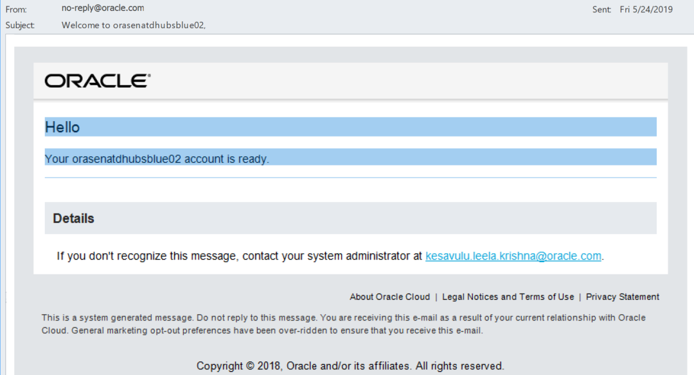
*
Figure 1: Account Ready Email 
*

If you recieved an email that looks like this one 

-   Oracle Cloud access has been made available to you by the Cloud
    Administrator

-   Then you next action will be in the To Access the Oracle Cloud section, and these others are examples your customer may recieve; again dependent upon how the Cloud Administrator set up accounts.

## The Account Activation Email - Sign In For the First Time

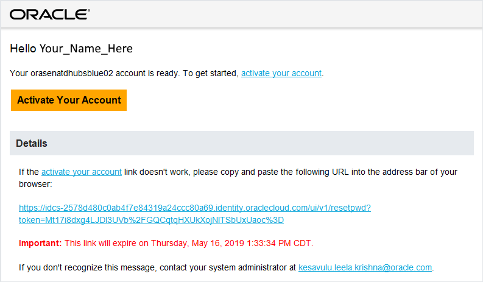
*
Figure 2: Activate Your Account
*

If you recieved an email that looks like this one 

-   Select Activate
-   It will take you to the reset password page
-   Reset it using following these criteria

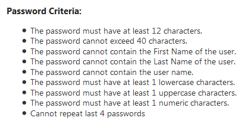
*
Figure 3: Password Criteria
*

## Another Access Email Type

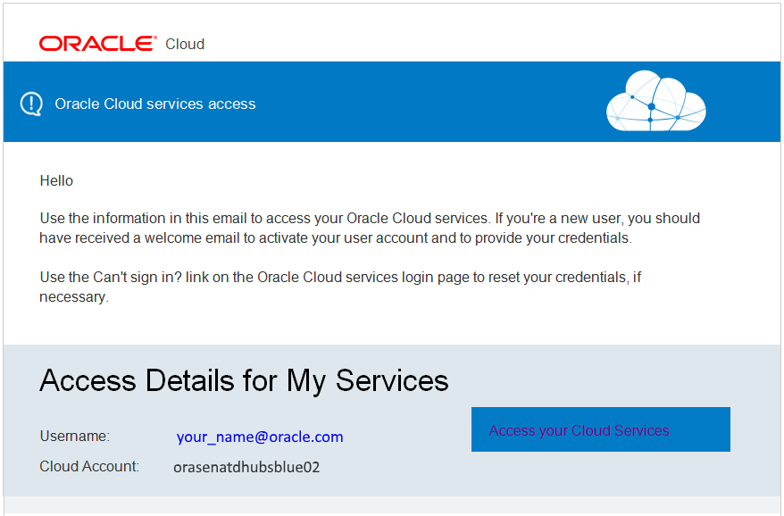
*
Figure 4: Another Access Email Example
*

In some circumstances, you may receive a separate Oracle Cloud email and in that email is an Access your Cloud Services link

As that may not always be available, we will next go through how to access Oracle Cloud should someone have not gotten that link, or it’s not available

## To Access the Oracle Cloud
#### Step 1: Enter URL **http://cloud.oracle.com/en_US/sign-in** into your browser.

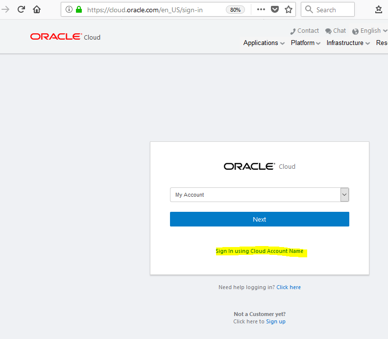
*
Figure 5: Cloud Account Sign In
*

#### Step 2: Enter the Tenancy Name  orasenatdhubsblue02 into the account dialog box
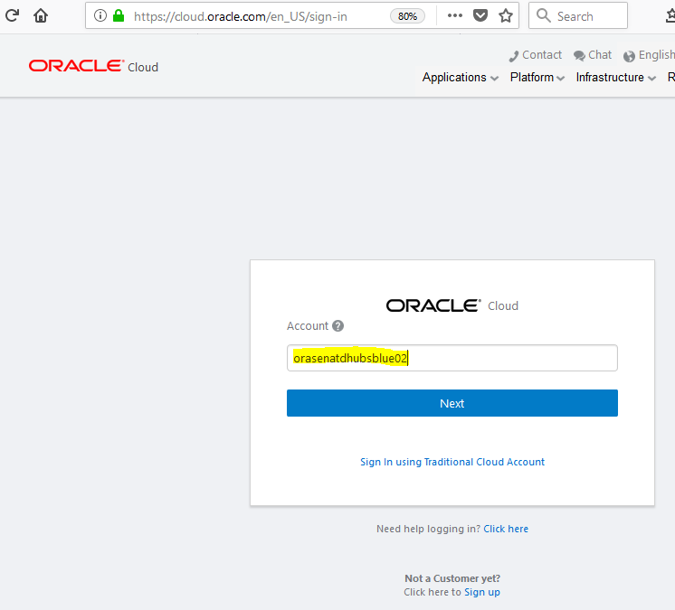
*
Figure 6: Enter Tenancy Name
*

#### Step 3: Choose Sign in with Oracle SSO

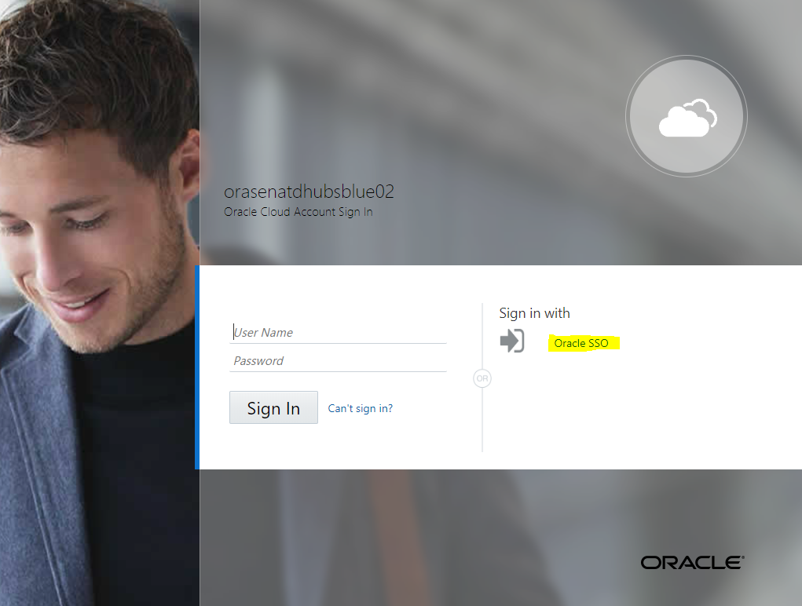

*
Figure 7: Oracle SSO Login
*

#### Step 4: Enter your standard SSO credentials

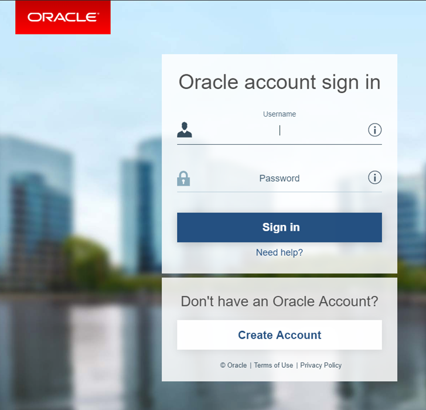

*
Figure 8: Enter your SSO credentials
*

Upon Login You Should See

**Oracle Cloud My Services Guided Journey**

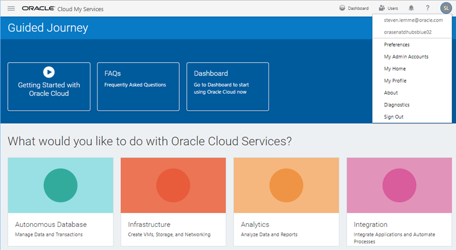
*
Figure 9: Guided Journey
*

**Unless you see** the Oracle Cloud My Services My Home page which is variable upon how the Cloud Administrator setup the account.

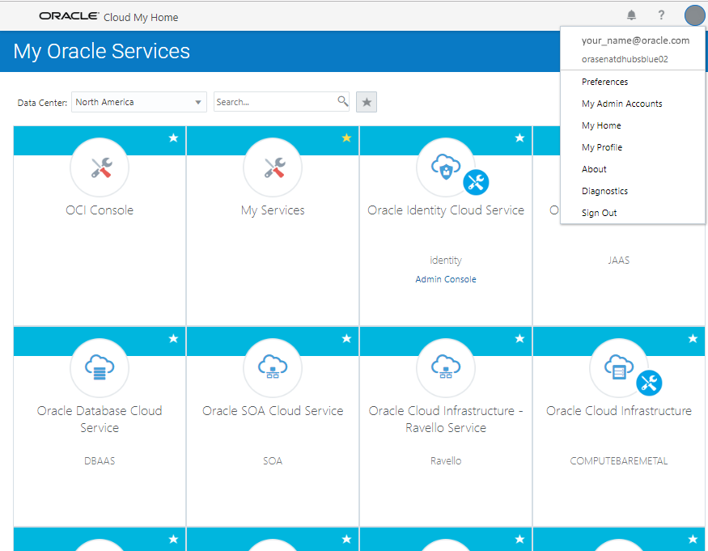

*
Figure 10: Oracle Cloud My Home page
*

Activity - Sign Into Oracle Cloud For First Time

*
Figure 11: Password Criteria
*

1.  Enter the user name and temporary password from the welcome email and click
    Sign In
2.  You’ll be prompted to change your password the first time you sign in.
3.  Depending on how you signed up for Oracle Cloud, you’ll be directed to
    either: Oracle Cloud My Home or Oracle Cloud Guided Journey page

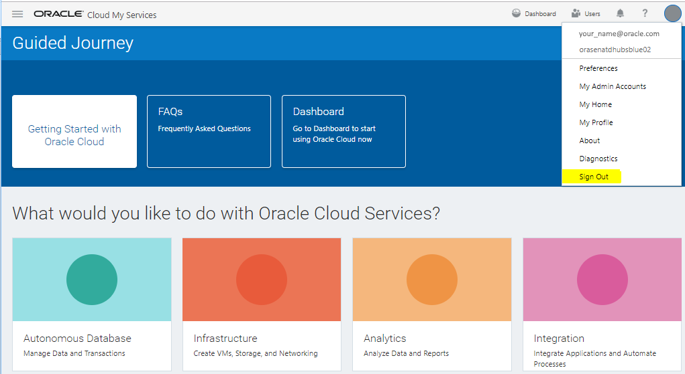
*
Figure 12: Sign Out
*

Log out from the circle drop down menu

Oracle Cloud My Services Navigation

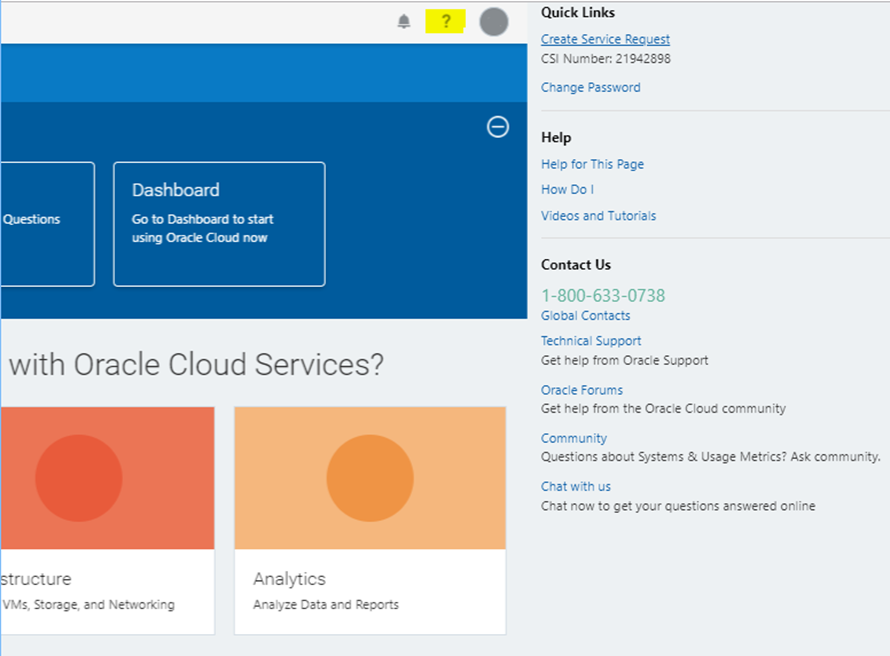
*
Figure 13: Help Icon
*

**Lab steps**

1.  Selecting the ? , to the left of the circle, a drop down menu appears with
    links to help resources

2.  In the **Contact Us** section, the help number for customers or for account
    administrators who have their own Customer Support Identifier (CSI)

3.  In the **Help** section, you can explore the *How Do I* and *Video and
    Tutorials* selections

4.  Be sure to explore the *Help for This Page* link as it takes you in-context
    into the documentation to explain what you are looking at, and how to use it

Oracle Cloud My Services

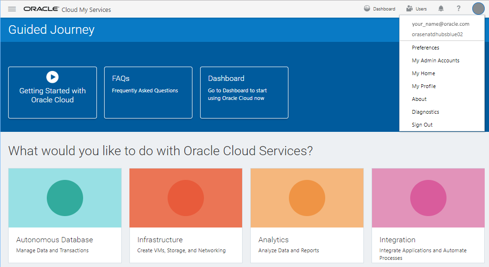
*
Figure 14: Help Icon Continued
*

-   From the circle, drop down menu, is where to view user account specific
    information & set preferences

-   Choose **Preferences** to see language and time preferences

-   Select **User Management** and view where password, user account information
    can be updated

-   If you select **My Home,** you would be taken to the My Services My Home
    page we showed you earlier

-   Select **Diagnostics** and run a throughput test

-   Feel free to explore, *but don’t perform or save* any actions, besides a
    throughput test as it may impact your ability to perform labs later

Oracle Cloud My Services

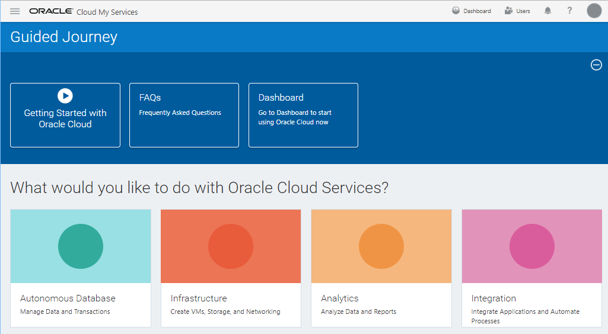
*
Figure 15: Guided Journey
*

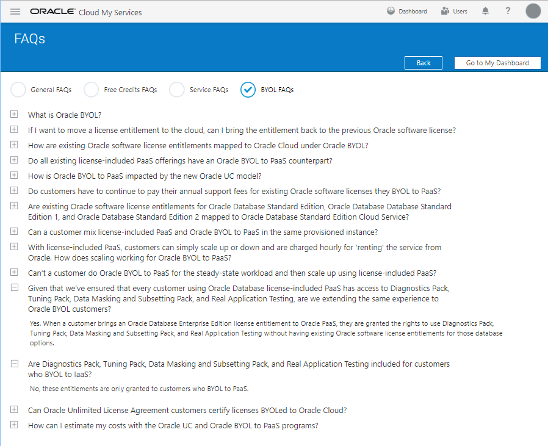
*
Figure 16: Frequently Asked Questions
*

Dashboard

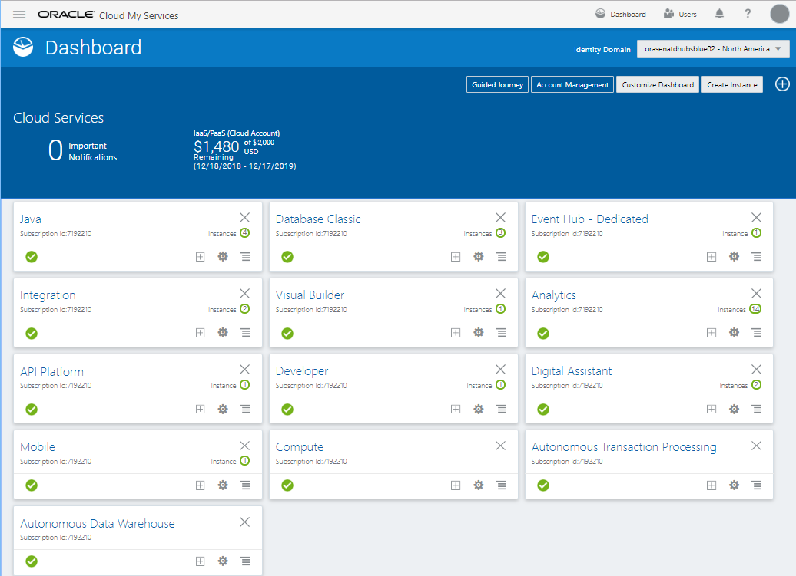
*
Figure 17: Oracle Cloud Services Dashboard
*

Summary of Learning

-   You can now successfully login and out of the Oracle Cloud so you can use it
-   You can now navigate around the Oracle Cloud console to perform different
    activities and initiate new cloud services instances
-   You are ready to execute the additional Oracle Cloud Hands On Labs this week
